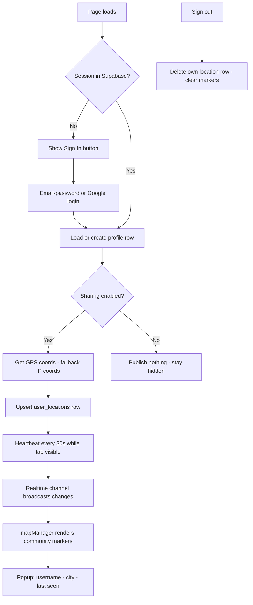

# GlobalPulse — Community Location Sharing Feature Plan

## Goal

Logged-in users can share their location and see other online users' locations on the map in real time.

## Stack Decisions

| Decision | Choice |
| --- | --- |
| Backend | Supabase (Auth + Postgres + Realtime) |
| Auth methods | Email + password, Google OAuth |
| Client lib | `@supabase/supabase-js` v2 via CDN (no build step) |
| Hosting | Static (Vercel) — unchanged |

## Database Schema (run in Supabase SQL Editor)

```sql
-- Public profile data (separate from auth.users)
create table public.profiles (
  id uuid primary key references auth.users(id) on delete cascade,
  username text unique not null,
  avatar_color text not null default '#06b6d4',
  created_at timestamptz not null default now()
);

-- One live-location row per user
create table public.user_locations (
  user_id uuid primary key references auth.users(id) on delete cascade,
  lat double precision not null,
  lon double precision not null,
  city text,
  country text,
  country_code text,
  precision_mode text not null default 'precise'
    check (precision_mode in ('precise', 'city')),
  sharing_enabled boolean not null default true,
  last_seen timestamptz not null default now()
);

alter table public.profiles enable row level security;
alter table public.user_locations enable row level security;

-- Profiles: readable by all, writable only by owner
create policy "profiles_select" on public.profiles
  for select using (true);
create policy "profiles_upsert" on public.profiles
  for insert with check (auth.uid() = id);
create policy "profiles_update" on public.profiles
  for update using (auth.uid() = id);

-- Locations: others see you ONLY while sharing is enabled
create policy "locations_select" on public.user_locations
  for select using (sharing_enabled = true or auth.uid() = user_id);
create policy "locations_upsert" on public.user_locations
  for insert with check (auth.uid() = user_id);
create policy "locations_update" on public.user_locations
  for update using (auth.uid() = user_id);

-- Enable realtime for live map updates
alter publication supabase_realtime add table public.user_locations;
```

## Privacy Model

- Sharing is **opt-in**: default ON after login, one-click toggle to pause (sets `sharing_enabled=false`, hides you from everyone).
- **Precision modes**: `precise` (GPS) or `city` (client rounds coords to ~0.05° ≈ 5 km grid before upload).
- Others never see email/user IDs — only username, avatar color, city/country label, last-seen time.
- Signing out deletes your row from `user_locations`.

## New Files

| File | Purpose |
| --- | --- |
| `supabase/schema.sql` | Migration SQL above, ready to paste into Supabase |
| `js/config.js` | `SUPABASE_URL` + `SUPABASE_ANON_KEY` placeholders |
| `js/services/supabaseService.js` | Auth wrappers, profile upsert, location publish + heartbeat, realtime subscription |
| `js/components/authModal.js` | Login/signup modal UI + header account chip + dropdown menu |

## Modified Files

| File | Change |
| --- | --- |
| `index.html` | supabase-js CDN script; Sign In button in nav-actions; auth modal markup; Community panel in map sidebar |
| `js/app.js` | Auth state bootstrap; publish location loop (GPS → fallback IP coords); wire community callbacks |
| `js/components/mapManager.js` | `updateCommunityMarkers(users)` — distinct marker style per remote user, themed popups, show/hide toggle |
| `css/style.css` | Modal, account chip, dropdown, community list styles (both themes) |
| `README.md` | Supabase setup guide: create project → run schema.sql → enable Google provider → paste keys into `js/config.js` |

## Runtime Flow



## Presence Rules

- A user appears "live" when `last_seen` is within 2 minutes.
- Heartbeat pauses when `document.hidden` (battery-friendly); resumes on visibility.
- Marker click → fly to user + popup with "Distance from me" (reuses Haversine logic).

## Setup Checklist for the User (documented in README)

1. Create free project at supabase.com
2. Paste `supabase/schema.sql` into SQL Editor and run
3. Authentication → Providers → enable Google (paste OAuth client ID/secret from Google Cloud Console)
4. Authentication → URL Configuration → add `https://<your-app>.vercel.app/**` redirect
5. Copy Project URL + anon key into `js/config.js`
